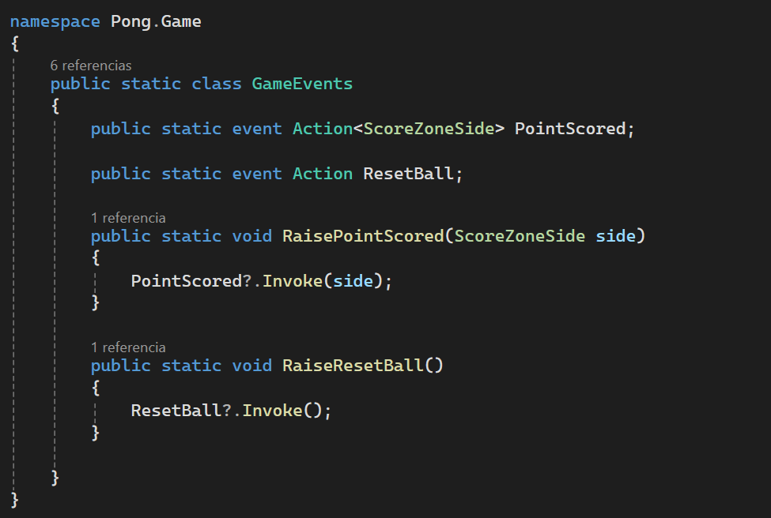
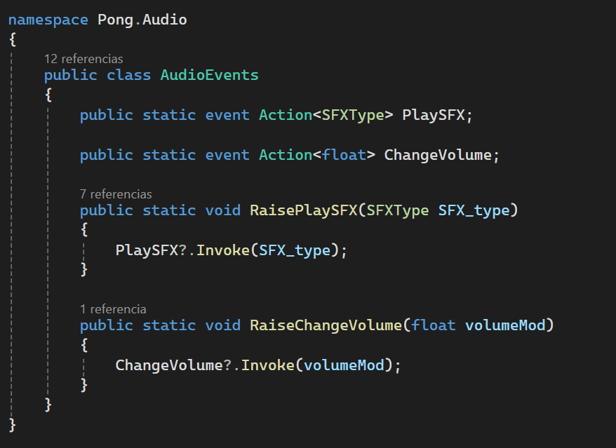
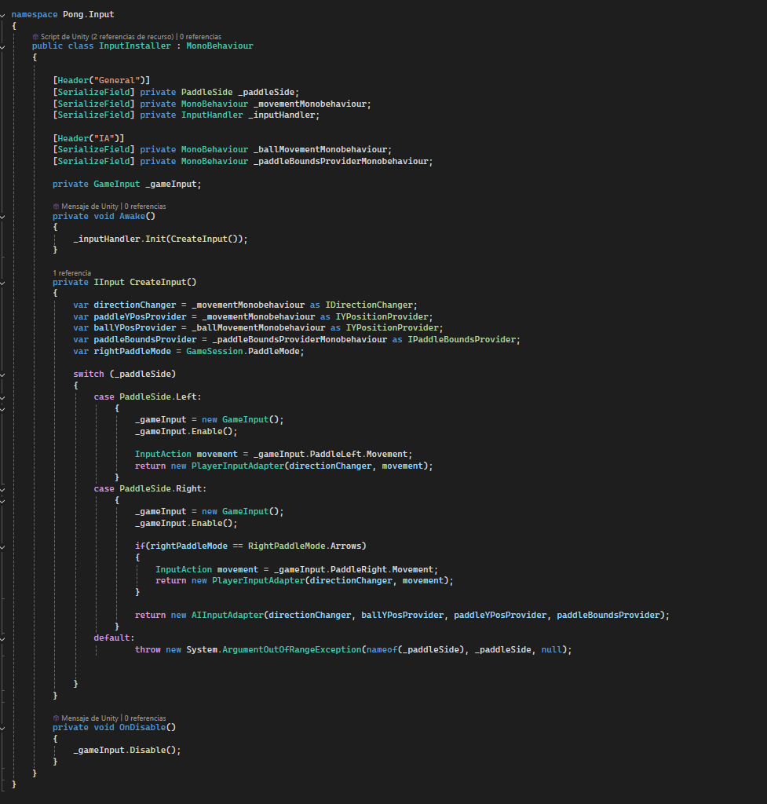
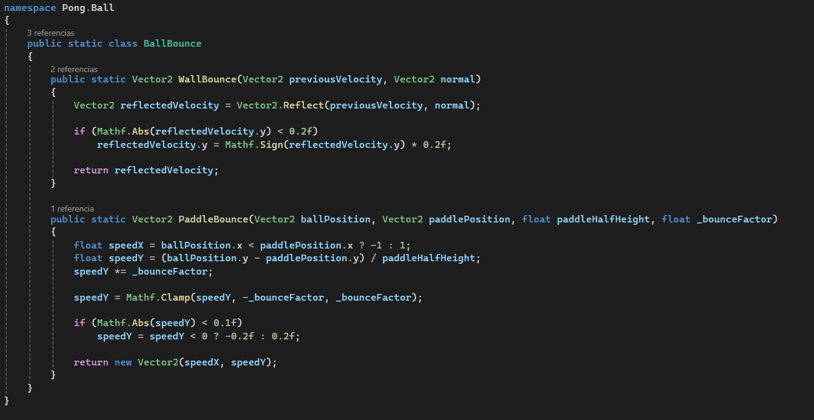

# 🏓 Pong — Architecture & Gameplay Case Study

This project focuses not only on gameplay but on **clean architecture, system design, and maintainability**.

The goal was to build a simple game using **professional development practices**, treating it as a small-scale production.

---

## 🔗 Links

* 👉 **Repository**: https://github.com/nicomirr/Pong
* 👉 **Playable Build (Itch.io)**: (ADD LINK HERE)
* 👉 **Web Build / Demo**: (ADD LINK HERE IF AVAILABLE)

---

## 🎮 Gameplay

* Classic Pong experience
* Player vs Player / Player vs AI
* Adjustable difficulty
* Responsive controls and tuned game feel

---

## 🧠 Technical Overview

This project emphasizes **separation of concerns, scalability, and flexibility**.

### 🧩 Architecture

* SOLID principles applied across systems
* Clear separation between input, movement, collision, and game flow
* Systems designed to be reusable and extensible

---

## 🔁 Architecture & Patterns

### 📡 Event-driven communication (Observer)

Game systems communicate through events instead of direct references.

* Decouples gameplay, scoring, and audio systems
* Improves scalability and maintainability

**Gameplay events**

**Audio events**

---

### 🎮 Input architecture (Adapters + interchangeable behavior + Installers)

The input system is built around a shared abstraction, allowing paddles to be controlled either by the player or by AI.

* Adapters unify different input sources under a common interface
* Behavior can be swapped depending on game mode (player or AI)
* Installers handle dependency composition and implementation selection

---

## ⚙️ Gameplay & Physics

### 🏓 Custom Bounce System

The bounce system is manually controlled instead of relying entirely on Unity’s default physics.

* Paddle bounce angle depends on impact position
* Prevents shallow-angle edge cases
* Ensures consistent and predictable gameplay

---

### 🤖 AI Behavior

* Tracks ball position with configurable reaction
* Difficulty affects speed and responsiveness
* Designed to feel fair, not perfect

---

## 📂 Project Structure

The codebase is organized by gameplay domains and responsibilities:

* **Ball** → movement, collision, and bounce logic
* **Paddle** → paddle movement and behavior
* **Input** → player and AI input abstractions
* **Game** → game flow and events
* **Audio** → sound event handling and playback
* **Difficulty** → gameplay tuning and configuration
* **UI** → menus and interface
* **Scenes** → scene management and flow
* **Tags** → lightweight components used for identification

This structure helps keep systems **decoupled, readable, and easy to maintain**.

---

## 🎯 Key Learnings

* Applying architecture principles to small-scale projects
* Understanding when abstraction adds value (and when it doesn't)
* Balancing clean code with practical gameplay needs
* Designing systems that can scale beyond a simple prototype

---

## 🚀 Future Improvements

* More advanced AI behaviors
* Better visual feedback and juice
* Expanded game modes

---

## 📸 Media

(Add gameplay GIFs or screenshots here)

---

## 📫 About Me

I'm focused on **gameplay programming, architecture, and AI systems**.

👉 https://github.com/nicomirr
